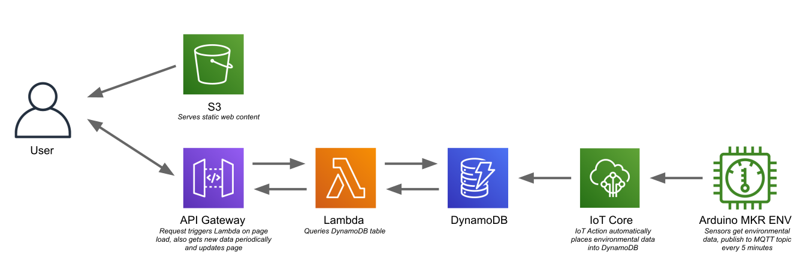

# serverless-environmental-monitor
An environmental monitor built with AWS and the Arduino MKR ENV SHIELD sensor board.

Arduino device sends data to IoT Core, and from there the data is placed into DynamoDB. A react app in an S3 bucket is then used to view the data, which is retrieved from DynamoDB using Lambda.
