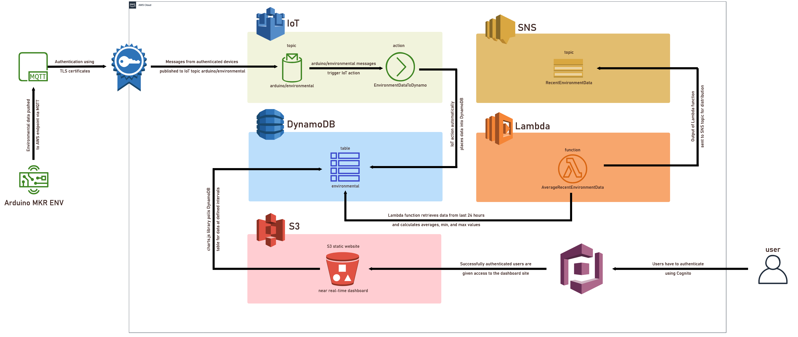

# serverless-environmental-monitor
An environmental monitor built with AWS and the Arduino MKR ENV SHIELD sensor board.

Arduino device sends data to IoT Core, from there the data is placed into DynamoDB, where a static site hosted in an S3 bucket can read it and give real time information on a JS dashboard.

The data transmission and storage is now complete, the site and authentication is still to be done.
